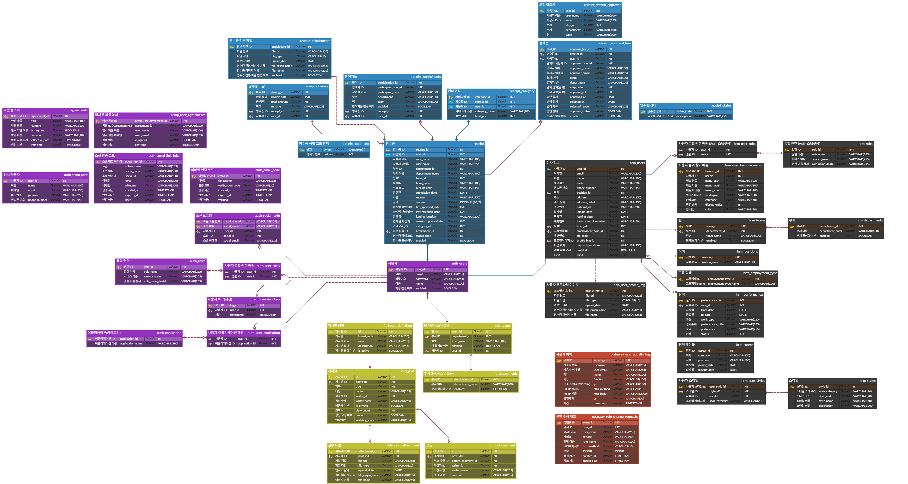

# Centrally System 데이터베이스 ERD

본 문서는 Centrally System 프로젝트의 데이터베이스 테이블 관계를 다이어그램으로 표현합니다.

## 전체 ERD 이미지

> **참고**: 이미지를 클릭하면 확대하여 확인할 수 있습니다. 마우스 휠로 확대/축소하고 드래그로 이동할 수 있습니다.

## 주요 관계 설명

1. **Auth ↔ HRM**: `user_id`로 연결 (Kafka 이벤트로 동기화)
2. **Auth ↔ Receipt**: `user_id`로 연결 (마이크로서비스 간 참조)
3. **HRM ↔ Receipt**: `department_id`, `team_id`로 연결 (Kafka 이벤트로 동기화)
4. **Auth ↔ Info**: `writer_id`로 연결 (마이크로서비스 간 참조)
5. **HRM ↔ Info**: 부서/팀 정보를 Kafka 이벤트로 동기화

## 참고사항

- 모든 주요 테이블은 Soft Delete 패턴을 사용합니다 (`enabled`, `deleted_at` 컬럼)
- 마이크로서비스 간 직접 FK 제약조건은 없으며, ID를 통한 논리적 참조를 사용합니다
- 서비스 간 데이터 동기화는 Kafka 이벤트를 통해 이루어집니다
- 논리명은 각 컬럼의 `@Comment` 어노테이션에 정의된 한글 설명을 기반으로 작성되었습니다
- 본 ERD는 실제 엔티티 클래스를 기반으로 작성되었습니다

## 데이터베이스 스키마 정보

### 공통 컬럼 (상속)

#### AuditTimeEntity를 상속받는 테이블
- `regTime` (생성 시간)
- `updateTime` (수정 시간)
- `createdBy` (생성자)
- `modifiedBy` (수정자)

#### SoftDeleteEntity를 상속받는 테이블 (AuditTimeEntity도 상속)
- `enabled` (활성화 여부)
- `deleted_at` (삭제 일시)
- 위 AuditTimeEntity의 모든 컬럼

### 주요 제약조건

- `auth_users.email`: UNIQUE
- `auth_temp_users.email`: UNIQUE
- `hrm_users.email`: UNIQUE
- `receipt.receipt_code`: UNIQUE
- `auth_refresh_tokens.token_value`: UNIQUE
- `auth_email_code.email`: UNIQUE
