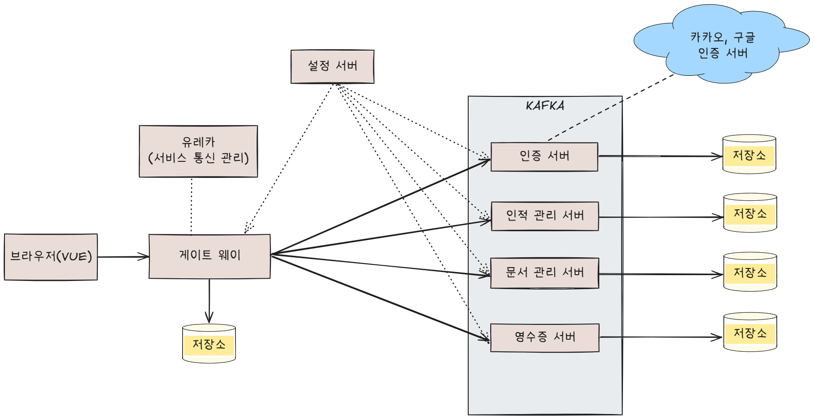

# 인프라 개요



<br>

## 📋 목차

1. [시스템 아키텍처](#1-시스템-아키텍처)
2. [주요 구성 요소](#2-주요-구성-요소)
3. [네트워크 구조](#3-네트워크-구조)
4. [관련 문서](#4-관련-문서)

<br>

---

## 1. 시스템 아키텍처

본 시스템은 **마이크로서비스 아키텍처**를 기반으로 구성되어 있습니다.

**아키텍처:**
- `아키텍처.png`: 시스템 전체 아키텍처
- `아키텍처.excalidraw`: Excalidraw 소스 파일

<br>

## 2. 주요 구성 요소

### 2.1 프론트엔드

**역할:** 사용자 인터페이스 제공

- **Vue 3 + Vite**: 단일 페이지 애플리케이션
- **BootstrapVue3 / Vuetify**: UI 프레임워크
- **Axios**: HTTP 클라이언트

<br>

### 2.2 게이트웨이

**역할:** API 게이트웨이 및 라우팅

- **Spring Cloud Gateway**: API 게이트웨이
- 라우팅, 인증, 로드 밸런싱 담당

<br>

### 2.3 마이크로서비스

**역할:** 비즈니스 로직 처리

- **AUTH 서비스**: 인증 및 권한 관리
- **INFO 서비스**: 게시판 및 공지사항
- **RECEIPT 서비스**: 영수증 관리
- **HRM 서비스**: 인사 관리

<br>

### 2.4 인프라 컴포넌트

**역할:** 시스템 인프라 지원

- **Eureka**: 서비스 디스커버리
- **Kafka**: 메시지 브로커
- **PostgreSQL**: 데이터베이스
- **Nginx**: 리버스 프록시 및 정적 파일 서빙

<br>

---

## 3. 네트워크 구조

**요청 흐름:**

```
[클라이언트]
    ↓
[Nginx] (포트: 80/443)
    ↓
[Spring Cloud Gateway] (포트: 7070)
    ↓
[마이크로서비스들]
    ├─ AUTH (포트: 9001)
    ├─ INFO (포트: 9699)
    ├─ RECEIPT (포트: 9899)
    └─ HRM (포트: 9999)
    ↓
[인프라 컴포넌트]
    ├─ Eureka (포트: 8761)
    ├─ Kafka (포트: 9092)
    └─ PostgreSQL (포트: 5432)
```

<br>

---

## 4. 관련 문서

### 📚 인프라 관련 가이드

- [파일 업로드 및 다운로드 가이드](../../가이드/파일%20업로드%20및%20다운로드%20가이드.md)
- [AWS 배포 가이드](../../가이드/AWS%20배포%20가이드.md)
- [CICD 배포 가이드](../../가이드/CICD%20배포%20가이드.md)
- [JENKINS 설정 가이드](../../가이드/JENKINS%20설정%20가이드.md)
- [인프라 보안 설정 가이드](../../가이드/인프라%20보안%20설정%20가이드.md)

<br>

### 🔧 서비스별 문서

- [AUTH 서비스](../SERVICE/AUTH/)
- [INFO 서비스](../SERVICE/INFO/)
- [RECEIPT 서비스](../SERVICE/RECEIPT/)
- [HRM 서비스](../SERVICE/HRM/)
- [CORE 서비스](../SERVICE/CORE/)

<br>

---

**작성일**: YYYY-MM-DD  
**최종 수정일**: YYYY-MM-DD

