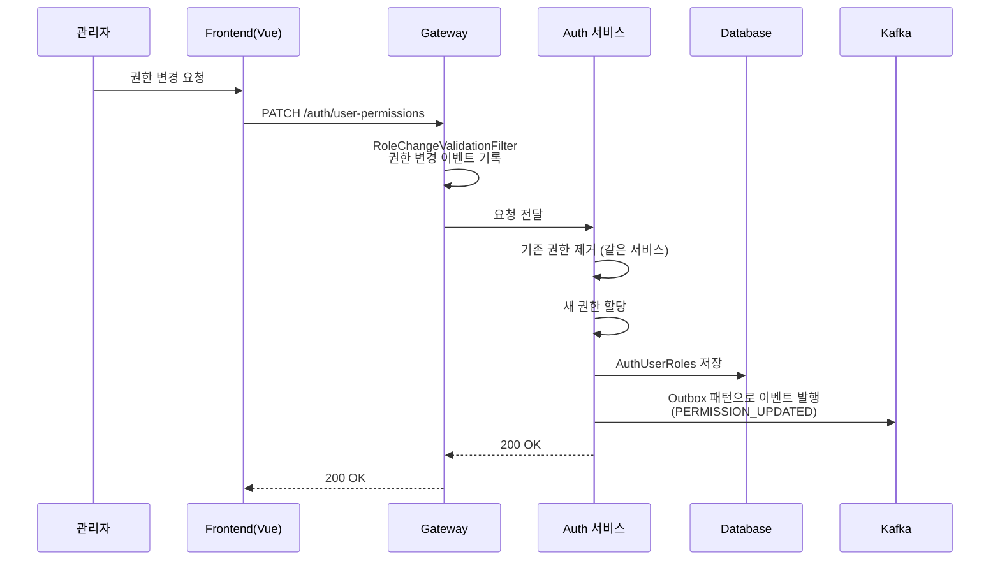
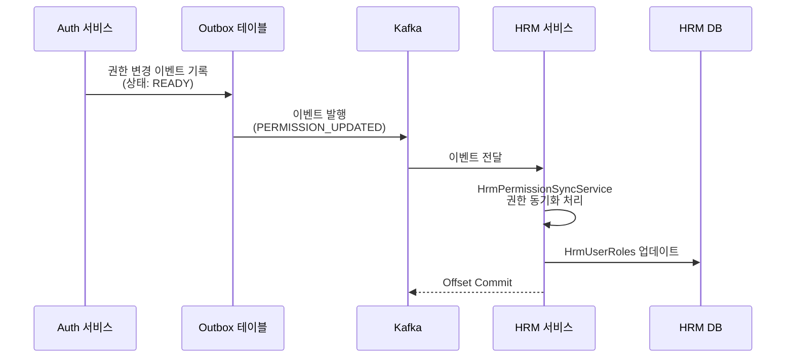
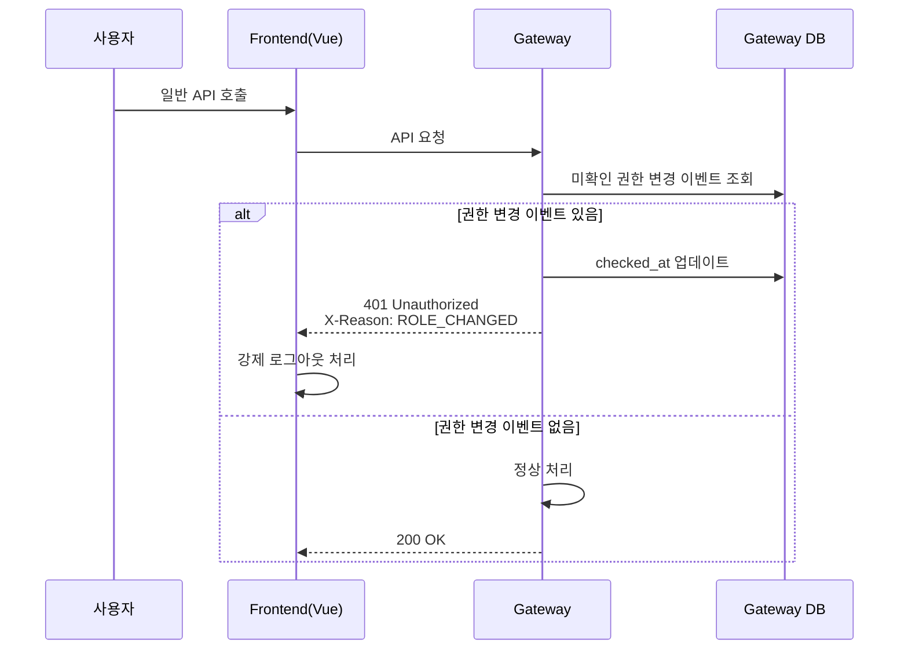
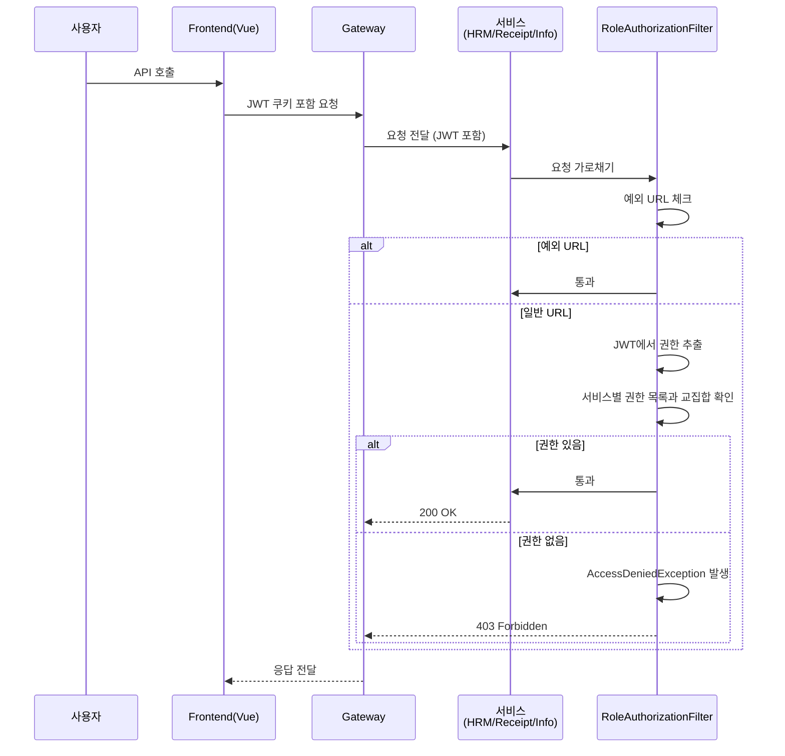
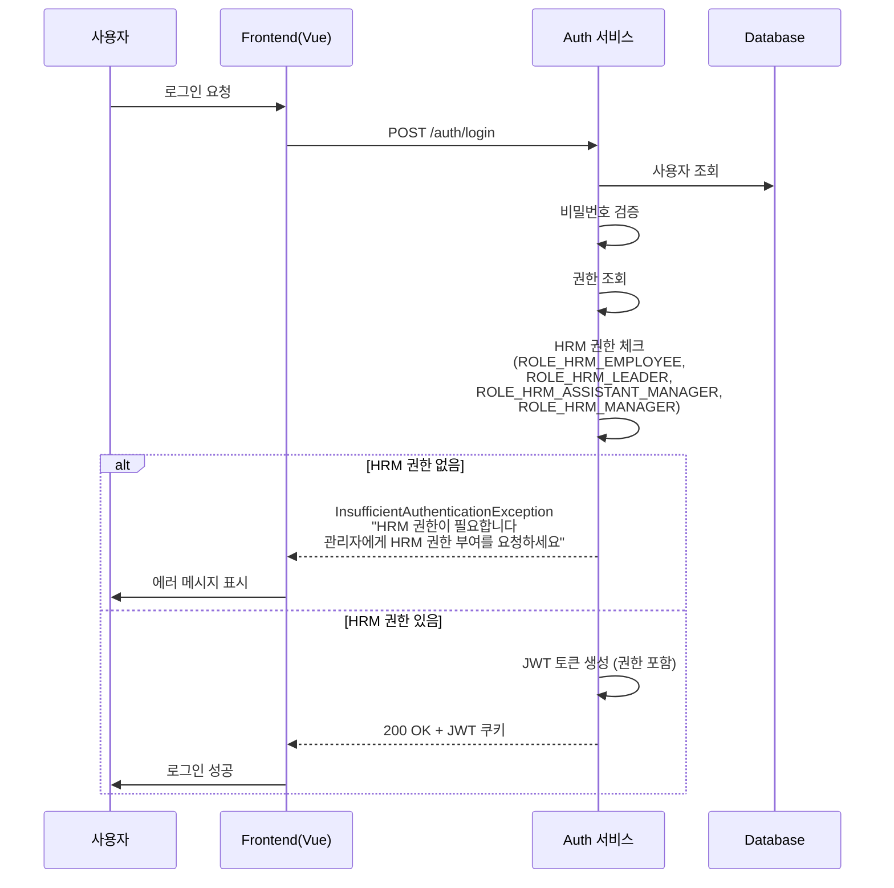
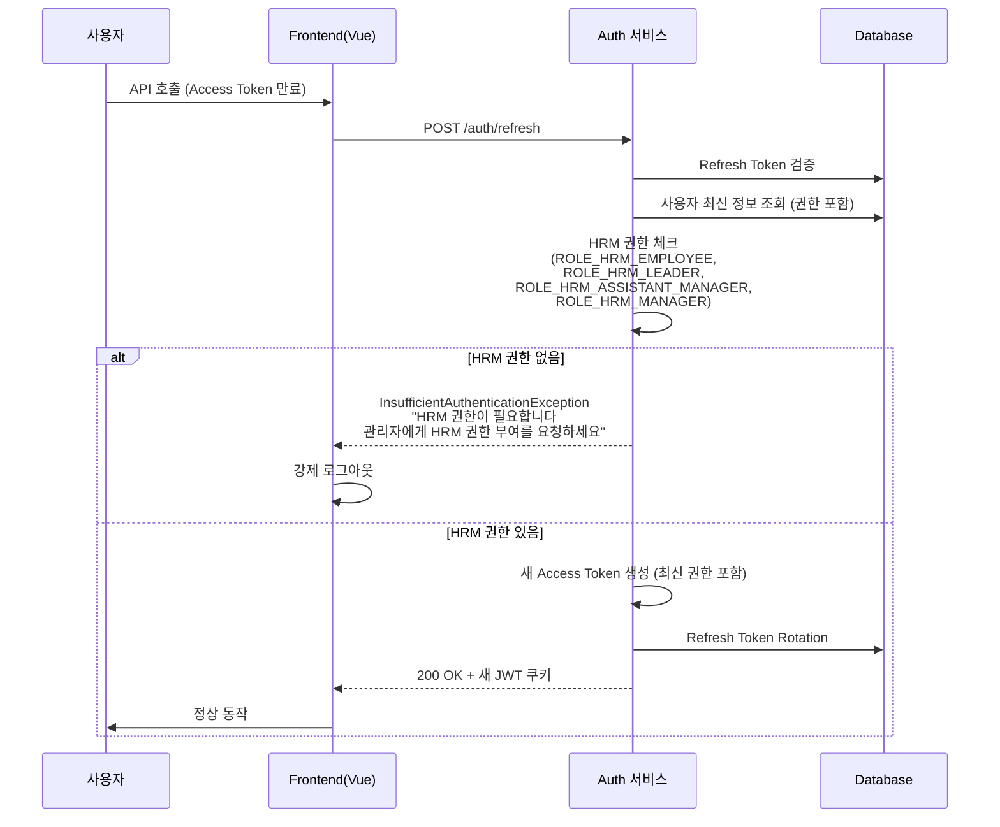
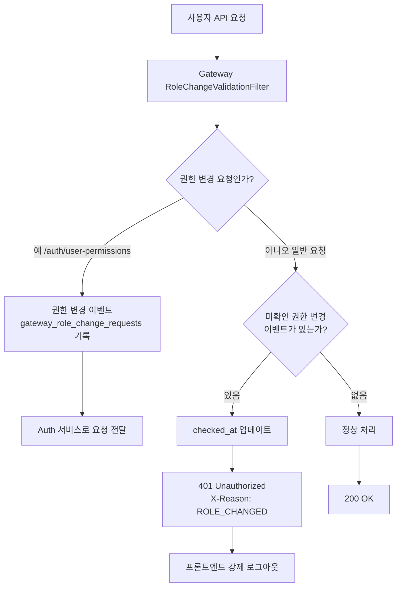
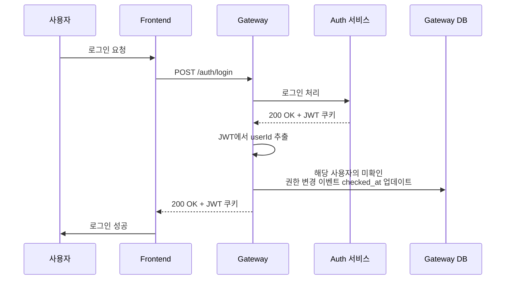

# 서비스 권한 체계

<br>

## 🔐 권한 체계

### 권한 구조 개요

AUTH 서비스는 시스템 전체의 권한을 중앙 관리하며, 각 서비스별로 권한을 구분합니다.

**권한 도메인 분류:**

- `HRM`: 인사 관리 서비스 권한
- `RECEIPT`: 영수증 서비스 권한
- `INFO`: 정보 관리 서비스 권한
- `SYSTEM`: 시스템 권한

---

### 전체 권한 목록

### 1. HRM 권한 (인사 관리)

| 권한 코드 | 권한명 | 설명 | 계층 순서 |
| --- | --- | --- | :---: |
| ROLE_HRM_EMPLOYEE | 사원 | 기본 인사 권한 (최하위) | 1 |
| ROLE_HRM_LEADER | 리더 | 리더 권한 | 2 |
| ROLE_HRM_ASSISTANT_MANAGER | 중간관리자 | 서브 관리자 권한 | 3 |
| ROLE_HRM_MANAGER | 관리자 | 인사 관리자 권한 (최상위) | 4 |

**권한 계층:**

```
EMPLOYEE < LEADER < ASSISTANT_MANAGER < MANAGER
```

### 2. RECEIPT 권한 (영수증)

| 권한 코드 | 권한명 | 설명 | 계층 순서 |
| --- | --- | --- | :---: |
| ROLE_RECEIPT_REGISTRAR | 등록자 | 영수증 등록 및 조회 권한 (최하위) | 1 |
| ROLE_RECEIPT_APPROVER | 결재자 | 결재 권한 (승인/반려) | 2 |
| ROLE_RECEIPT_INSPECTOR | 검수자 | 검수 권한 | 3 |
| ROLE_RECEIPT_FINALIZER | 확정자 | 최종 확정 권한 | 4 |
| ROLE_RECEIPT_MANAGER | 관리자 | 영수증 관리자 권한 (최상위) | 5 |

**권한 계층:**

```
REGISTRAR < APPROVER < INSPECTOR < FINALIZER < MANAGER
```

### 3. INFO 권한 (정보 관리)

| 권한 코드 | 권한명 | 설명 | 계층 순서 |
| --- | --- | --- | :---: |
| ROLE_INFO_GUEST | 게스트 | 최소 권한 (읽기만 가능, 제한적) | 1 |
| ROLE_INFO_USER | 사용자 | 기본 읽기/쓰기 권한 | 2 |
| ROLE_INFO_MANAGER | 운영자 | 자료실 작성, 일반 관리 권한 | 3 |
| ROLE_INFO_ADMIN | 관리자 | 모든 권한 (공지사항 작성 등) | 4 |

**권한 계층:**

```
GUEST < USER < MANAGER < ADMIN
```

### 4. SYSTEM 권한 (시스템)

| 권한 코드 | 권한명 | 설명 |
| --- | --- | --- |
| ROLE_GATE_SYSTEM | 시스템 | 시스템 전체 관리 권한 |

---

<br>

## 🔄 권한 변경 흐름

### 권한 변경 처리 과정

#### 1단계: 권한 변경 요청



#### 2단계: Kafka 이벤트 발행 및 동기화



#### 3단계: 권한 변경 감지 및 로그아웃 유도



---

<br>

## 🚫 권한 체크 및 접근 거부

### 권한 체크 흐름

각 서비스(HRM, RECEIPT, INFO)는 `RoleAuthorizationFilter`를 통해 권한을 체크합니다.



### 로그인 시 권한 체크

로그인 시 사용자는 HRM 권한 중 하나라도 보유해야 합니다.

**체크하는 HRM 권한:**
- `ROLE_HRM_EMPLOYEE` (사원)
- `ROLE_HRM_LEADER` (리더)
- `ROLE_HRM_ASSISTANT_MANAGER` (중간관리자)
- `ROLE_HRM_MANAGER` (관리자)



---

<br>

## 🔄 Refresh Token 갱신 시 권한 반영

권한 변경 후 Refresh Token으로 새 Access Token을 발급받으면, 최신 권한 정보가 반영됩니다. 이때도 HRM 권한이 있는지 체크합니다.



---

<br>

## 🛡️ Gateway 권한 실시간 체크 및 강제 로그아웃

Gateway는 모든 API 요청을 가로채서 권한 변경을 실시간으로 감지하고, 권한이 변경된 사용자에게 강제 로그아웃을 유도합니다.

### 동작 원리



### 권한 변경 감지 과정

1. **권한 변경 이벤트 기록**
   - 관리자가 권한을 변경하면 Gateway의 `RoleChangeValidationFilter`가 이를 감지
   - `gateway_role_change_requests` 테이블에 권한 변경 이벤트를 기록 (`checked_at` = NULL)

2. **실시간 권한 변경 체크**
   - 사용자가 일반 API를 호출할 때마다 Gateway가 해당 사용자의 미확인 권한 변경 이벤트를 조회
   - 미확인 이벤트가 존재하면 `checked_at`을 현재 시간으로 업데이트

3. **강제 로그아웃 유도**
   - 401 Unauthorized 응답과 함께 `X-Reason: ROLE_CHANGED` 헤더를 전달
   - 프론트엔드는 이 헤더를 확인하고 자동으로 로그아웃 처리

### 로그인 시 이벤트 소거

사용자가 재로그인하면 로그인 성공 시점에 해당 사용자의 모든 미확인 권한 변경 이벤트가 자동으로 소거됩니다.



### 핵심 특징

- **실시간 감지**: 권한 변경 시 즉시 Gateway에 이벤트 기록
- **자동 로그아웃**: 권한 변경된 사용자가 다음 API 호출 시 자동으로 로그아웃 처리
- **최신 권한 반영**: 재로그인 시 최신 권한 정보로 JWT 토큰이 새로 발급됨
- **트랜잭션 안전성**: 권한 변경 이벤트는 DB에 안전하게 저장되며, 사용자가 재로그인할 때까지 유지

---

<br>

## ⚠️ 주의사항

1. **권한 변경 즉시 반영**: 권한 변경 후 사용자는 재로그인하거나 Refresh Token으로 새 Access Token을 발급받아야 변경 사항이 반영됩니다.

2. **서비스별 권한 독립성**: 한 사용자는 여러 서비스에 각각 다른 권한을 가질 수 있습니다. (예: HRM 관리자 + Receipt 등록자)

3. **권한 계층**: 권한 간 계층 구조가 정의되어 있지만, 현재는 단순 비교로만 체크합니다. 향후 계층 기반 권한 검증이 필요할 수 있습니다.

4. **Outbox 패턴**: 권한 변경 이벤트는 Outbox 패턴을 통해 안전하게 Kafka로 전달되며, 트랜잭션 일관성을 보장합니다.

<br><br>
