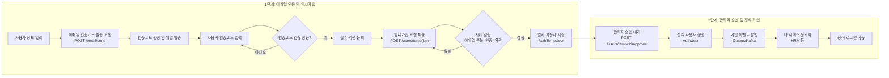
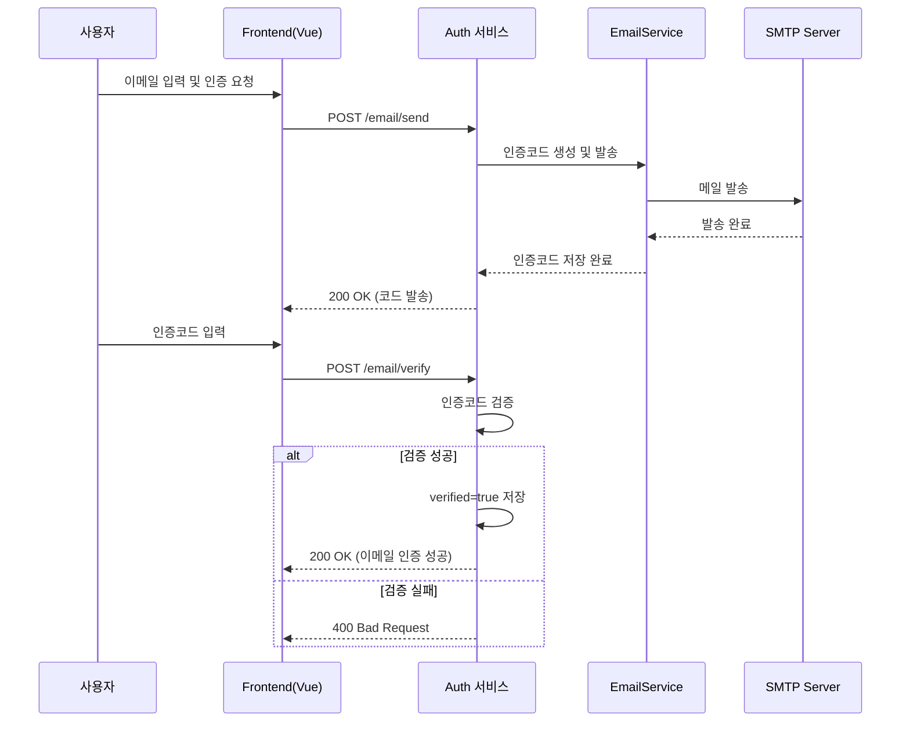
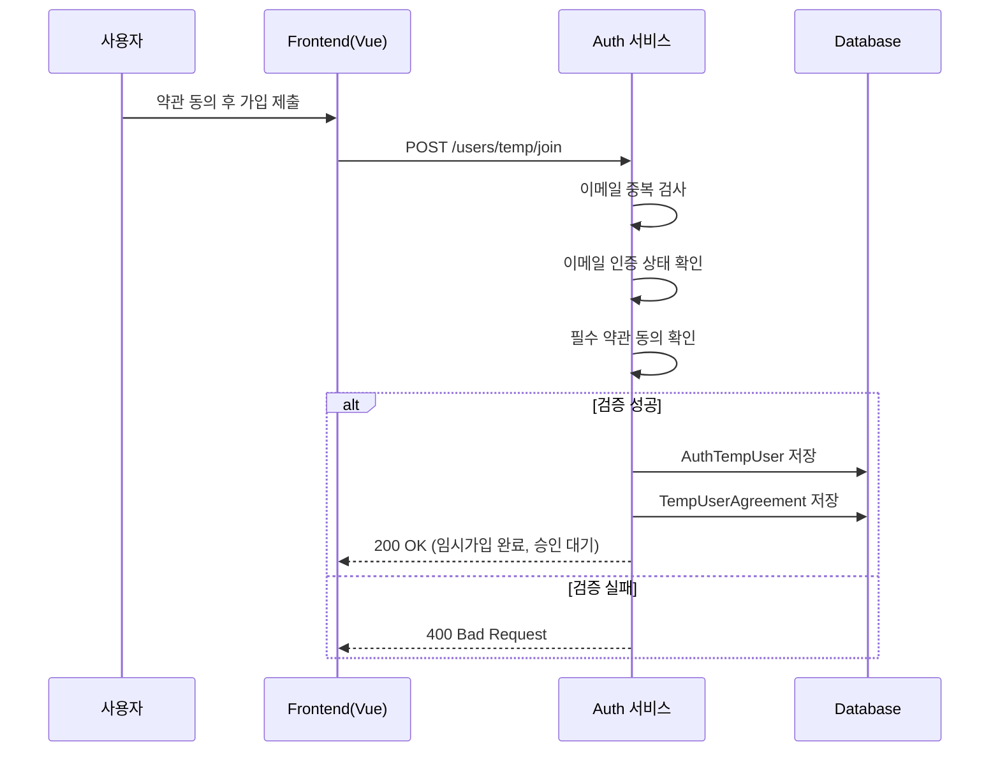
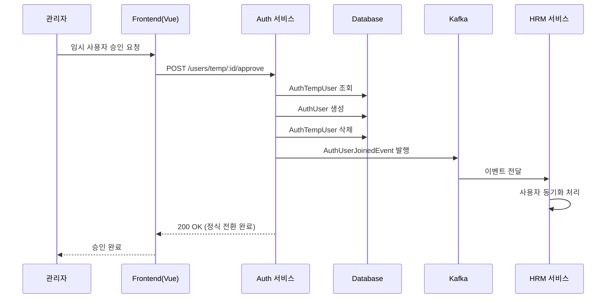

# 회원 가입 프로세스

 

## 🌱 흐름도

### 전체 흐름도

### 시퀀스 다이어그램 (인증/임시가입/승인)

#### 1단계: 이메일 인증

#### 2단계: 임시 가입

#### 3단계: 관리자 승인

### **엔드포인트 요약**

- **이메일 인증**
    - **POST** `/email/send`: 인증코드 발송
    - **POST** `/email/verify`: 인증코드 검증(성공 시 이메일 인증됨)
- **약관**
    - **GET** `/agreements`: 최신 약관 목록
- **임시가입/승인**
    - **GET** `/users/temp`: 임시 사용자 목록(관리자)
    - **POST** `/users/temp/join`: 임시 회원가입
    - **POST** `/users/temp/{id}/approve`: 임시 사용자 승인(정식 전환)
    - **DELETE** `/users/temp/{id}`: 임시 사용자 삭제

  

## **🌳 검증 규칙 핵심**

- **이메일 중복**: 정식/임시 사용자 모두 검사, 중복 시 거절
- **이메일 인증 필수**: `/email/verify` 성공 상태여야 임시가입 허용
- **필수 약관 동의**: 누락 시 거절
- **인증코드**: 6자리, 5분 만료. 만료/불일치 시 실패

### **메일 발송 개요**

---

- **목적**: 회원가입 이메일 인증, 비밀번호 찾기(임시 비밀번호 발급), 소셜 연동 알림
- **인증코드**: 6자리 숫자, 유효기간 5분, 검증 성공 시 DB에 verified=true

  