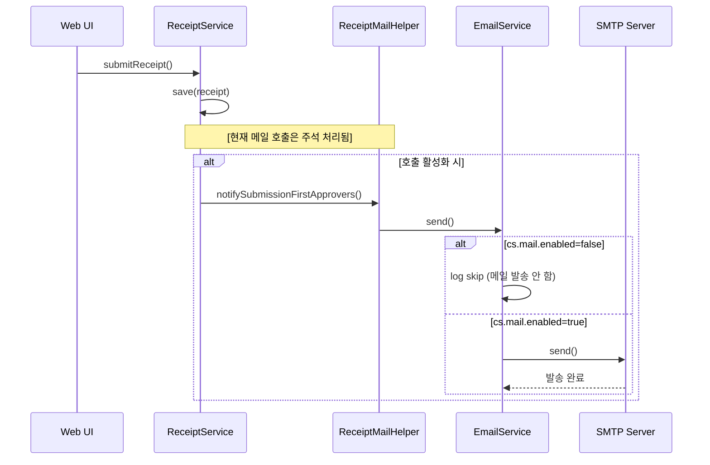
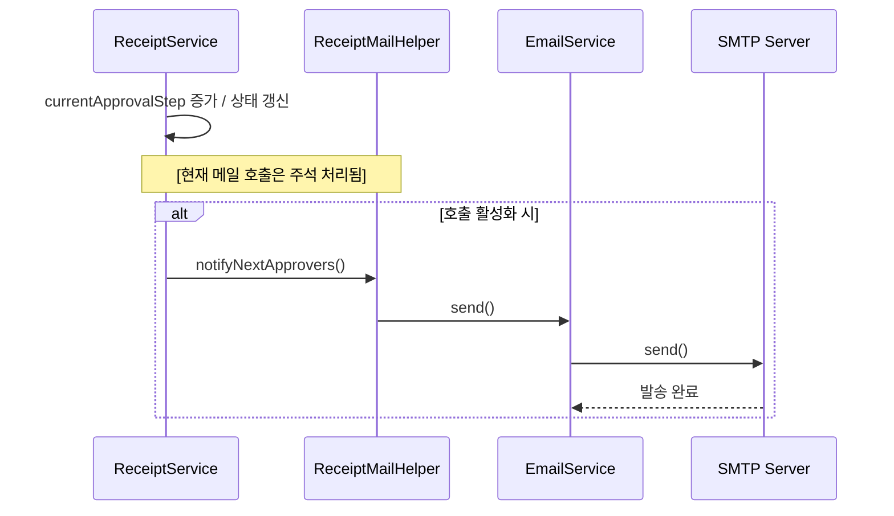
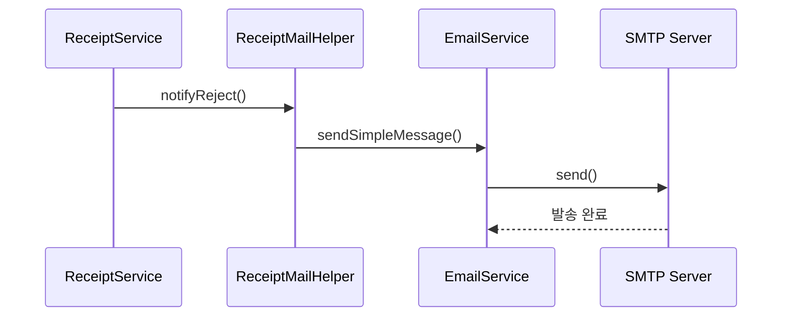

# 메일 발송 프로세스

### **구현 요약**

---

- **메일 전송 엔진**
    - EmailService가 JavaMailSender로 발송
    - @Async("mailExecutor") 비동기 처리
    - cs.mail.enabled로 전체 on/off.
    
- **영수증 메일 포인트**
    - **최초 제출 알림(1차 결재자)**: 메일 본문/제목 로직 존재하지만 호출이 현재 사용 안함.
    - **다음 결재자 알림**: 로직 존재하지만 호출이 현재 사용 안함.
    - **반려 알림**: 제출자에게 발송 로직이 실제로 호출됨.

- **프로퍼티**
    - 기본 receipt.properties에서 cs.mail.enabled=false라 실제 발송은 기본값으로 비활성
    - 운영/개발 프로필에서 별도 on 설정 가능.

<br><br>

## 동작 프로세스

### 1. 영수증 최초 제출


<br>

### 2. 단계 승인 진행


<br>

### 3. 반려


<br>

## 1. 메일 발송 트리거

현재 반려 시 제출자만 반려 메일 발송 나머지는 주석

1. 영수증
    
    **신청(REQUEST 전환)**
    
    - 서비스: ReceiptRequestService.requestReceipt()
    - 액션: 영수증을 저장한 직후
    - 메서드: ReceiptMailHelper.notifySubmissionFirstApprovers() 호출
    - 수신자: 결재선 stepOrder = 1 (첫 번째 결재자) 전원
2. **다음 단계** 결재 요청
    - 서비스: ReceiptRequestService.saveReceiptDecisions()
    - 조건: 현재 결재자가 ‘승인’했고 미결 라인이 남아 있을 때
    - 메서드: ReceiptMailHelper.notifyNextApprovers()
    - 수신자: 다음 stepOrder 에 해당하는 결재자
3. **반려(REJECTED 전환)**
    - 서비스:
        - 단건 saveReceiptDecisions()
        - 일괄 rejectReceipts()
        - 비활성 사용자 처리 rejectAndRemoveApprover()
    - 메서드: ReceiptMailHelper.notifyReject()
    - 수신자
        - 이미 승인 완료한 결재자(합의 제외)
        - + 영수증 ‘제출자’

<br>

## 2. 메일 제목 & 본문 형식

**① 신청 → 첫 결재자 메일**

**Subject**: `[Centrally-System] 영수증 결재 요청 - {식별코드}`

```
안녕하세요.

새로운 영수증 결재 요청이 도착했습니다.

[영수증 식별코드]   {식별코드}
[사유]            {reason 또는 (미입력)}
[금액]            {amount}원
[제출자]           {userName} ({userEmail})

시스템에 접속하여 결재를 진행해 주세요.

감사합니다.
CENTRALLY-SYSTEM 운영팀
```

**② 단계 이동 → 다음 결재자 메일**

**Subject**: `[Centrally-System] 영수증 결재 요청 - {식별코드}`

```
안녕하세요.

새로운 영수증 결재 요청이 도착했습니다.

[영수증 식별코드]   {식별코드}
[사유]            {reason 또는 (미입력)}
[금액]             {amount}원
[제출자]           {userName} ({userEmail})

시스템에 접속하여 결재를 진행해 주세요.

감사합니다.
CENTRALLY-SYSTEM 운영팀
```

**③ 반려 통보 메일**

**Subject**: `[Centrally-System] 영수증 반려 통보 - {식별코드}`

```
안녕하세요.

아래 영수증이 반려되었습니다.

[영수증 식별코드]   {식별코드}
[반려 사유]         {reason 또는 (미입력)}
[제출자]            {userName} ({userEmail})

확인 후 필요한 조치를 진행해 주세요.

감사합니다.
CENTRALLY-SYSTEM 운영팀
```

<br>

## 3. 구현 포인트

- 모든 메일 발송은 core 모듈의 EmailService 비동기(@Async) 호출로 지연 없이 전송
- 템플릿은 ReceiptMailHelper 내부 StringBuilder 로 작성 – 회사 명칭 / 연락처 문구 등 필요 시 한 곳에서 수정 가능

1. “신청 → 첫 결재자”, “승인 → 다음 결재자”, “반려 → 기승인자+제출자”의 **3-단계 자동 발송**
2. 모든 메일에 **식별코드 포함**으로 추적 용이
3. **운영팀 명의**의 통일된 서식 → 사용자 경험 일관성 확보

<br>