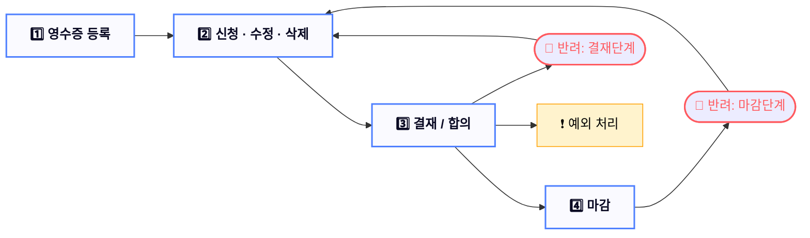

# 영수증 프로세스

 

### 🧾 영수증 처리 프로세스 안내서

**전체 흐름도**

**주요 흐름**
1. 영수증 등록 → 신청 · 수정 · 삭제 → 결재 / 합의 → 마감
2. 결재 단계에서 반려 시 → 신청 · 수정 · 삭제로 복귀 (재신청 가능)
3. 마감 단계에서 반려 시 → 신청 · 수정 · 삭제로 복귀 (재신청 가능)
4. 결재 단계에서 예외 처리 발생 가능

**1️⃣ 영수증 등록**

- 등록 시 영수증 상태는 `대기`로 설정됩니다.
- 기능 위치
    
    `영수증 > 영수증 등록 > [영수증 등록] 버튼`
    
- 필수 입력 항목
    
    
    | 항목 | 설명 |
    | --- | --- |
    | 영수증 사진 | 실물 사진 첨부 |
    | 발행일 | 영수증에 명시된 날짜 |
    | 카테고리 | 야근 식비, 출장비 등 분류 선택 |
    | 결재선 | 최대 3명까지 설정 가능 |
    | 합의자 | 인원 제한 없음 |
    | 사용 사유 | 텍스트 입력 |

**2️⃣ 신청 · 수정 · 삭제 가능 (대기 상태)**

- 기능 위치
    
    `영수증 > 영수증 등록`
    
- 가능한 작업
    - 등록한 영수증은 신청 전까지 **수정**, **삭제**, 또는 **신청**할 수 있습니다.
    - 반려된 영수증도 이 단계로 되돌아와 **재신청 가능**합니다.

**3️⃣ 결재 (합의 포함)**

- 기능 위치
    - `영수증 > 영수증 결재 신청 현황` → 테이블 클릭 → 상세 보기 → `[결재]`
    - `영수증 > 영수증 합의 신청 현황` → 테이블 클릭 → 상세 보기 → `[결재]`
- 결재자에게 보이는 조건
    - 본인이 **결재 차례**인 영수증만 보임
    - **승인 또는 반려** 가능
- 반려 시 주의사항
    - 반드시 **반려 사유**를 입력해야 하며, 영수증 히스토리에 반영됩니다.

**4️⃣ 마감**

- 기능 위치
    
    `영수증 > 결재 마감`
    
- 진행 방식
    - 결재가 완료된 영수증은 대표님의 컨펌 후 경영관리팀이 마감을 수행합니다.
    - 대표님이 반려한 건은 반려 처리되고, 승인한 건은 마감 완료 처리됩니다.

**5️⃣ 예외 처리**

❗ 결재 권한 상실 사용자 발생 시

- 결재 도중 결재선의 사용자가 권한 상실 또는 비활성화되면,
    
    해당 영수증은 **자동 반려**되며,
    
    반려 사유에 해당 사용자 정보가 기재됩니다.
    
    예: `결재자 홍길동(비활성화)로 인해 자동 반려 처리`
    

❗ 관리자 권한으로 강제 상태 변경 가능

- 관리자 권한을 가진 사용자는 영수증 상태를 **수동 변경**할 수 있으며,
    
    이때 반려된 경우 `반려 사유`에 강제 처리한 **관리자 이름**이 기록됩니다.
    

**참고 정보**

✅ 카테고리 관련 사항

- 카테고리는 관리자만 생성 가능합니다.
- 카테고리별로 **청구 상한 금액**이 존재하며, 상한을 초과하면 등록이 불가합니다.

**요약**

| 단계 | 설명 |
| --- | --- |
| 1. 등록 | 필수 정보 입력 후 `대기` 상태로 저장 |
| 2. 신청/수정/삭제 | `대기` 상태에서 신청, 수정, 삭제 가능 |
| 3. 결재/합의 | 결재자·합의자 승인 또는 반려, 반려 사유 필수 |
| 4. 마감 | 승인된 건을 대표 컨펌 후 최종 마감 |
| **5. 예외 처리** | **사용자 비활성화 및 권한 상실 시 자동 반려, 관리자 수동 조치 가능** |
